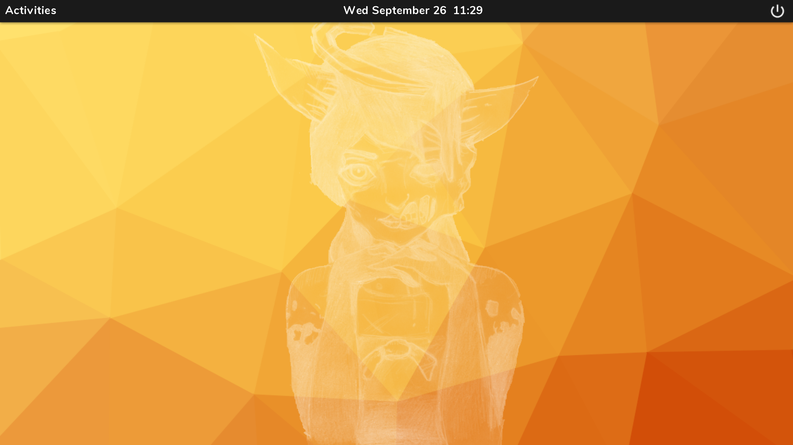

# Bendy is not GNOME (BinG) Desktop
A desktop shell applet for AliceOS

[](https://peertube.social/videos/watch/6f5fc50d-5fa0-497d-a7d0-c0053342659f)

## About this applet
BinG (_Bendy is not GNOME_) Desktop is a first-party desktop shell for AliceOS. It offers badic functionality in launching applets and providing a safe space to return to.

BinG's desktop insipiration draws from the GNOME 3 desktop environment and also follows the AliceOS design standards, including obeying OEM fonts.

### Features
- Launch applets quickly and efficiently.
- View date and time.
- Have a top bar visible all the time.
- Uses AliceOS desktop background settings

## Installing this Applet
This applet can be baked directly into AliceOS by dropping its source code into the main AliceOS code or can be installed with (TBD) APM:

```
apm install bing
```

